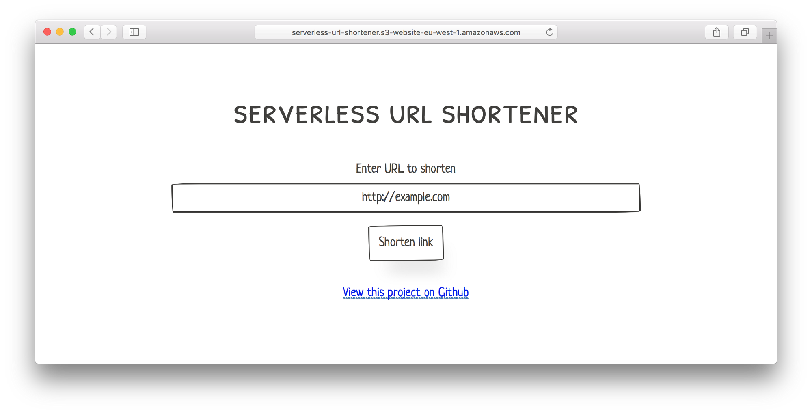

# Serverless URL Shortener
A lightweight URL shortener built with the Serverless Framework using AWS Lambda and S3. Each URL redirection is stored as an S3 object with the `Website-Redirect-Location` metadata key set to the forwarding web address. AWS Lambda is used to create an API to save these objects. The website is served from the same S3 bucket.

## Setup
### Install dependencies
Head on over to the [Serverless Framework docs](https://medium.com/r/?url=https%3A%2F%2Fserverless.com%2Fframework%2Fdocs%2Fproviders%2Faws%2Fguide%2Fquick-start%2F) and run through their quick-start guide. It’s mentioned in there as part of your setup, but be sure to install the AWS CLI and configure your AWS credentials. Then run `npm install` to get the NPM dependencies for the project.

### Add config
Create a copy of *config.sample.json* as *config.json* and then customise as appropriate for your setup.

Name | Description | Required
--- | --- | ---
BUCKET | The S3 bucket name to use. This will form part of the URL shortener website address if you're not using a custom domain. | Y
REGION | The [AWS region](http://docs.aws.amazon.com/AWSEC2/latest/UserGuide/using-regions-availability-zones.html) to deploy to. | Y
STAGE | The [AWS stage](http://docs.aws.amazon.com/apigateway/latest/developerguide/how-to-deploy-api.html) to deploy to. | Y
API_URL | The URL of the endpoint that forms should be sent to. This is only known after the first deployment, so leave empty for now. | Y

### Deploy API
Run `npm run deploy:serverless` to deploy the API to AWS. The resources defined in *serverless.yml* will be automatically instantiated using CloudFormation. You should copy the URL of the returned endpoint to *API_URL* in *config.json*.

### Build template
Run `npm run build` to set the form action on the website template to *API_URL* from *config.json*.

### Deploy website
Run `npm run deploy:static` to deploy the website using the AWS CLI.

## Libraries used
- [Serverless Framework](https://serverless.com) for project structure and deployment.
- [PaperCSS Framework](https://github.com/papercss/papercss) for the frontend design.
- [jQuery](https://jquery.com) to simplify working with the DOM and making AJAX queries.
