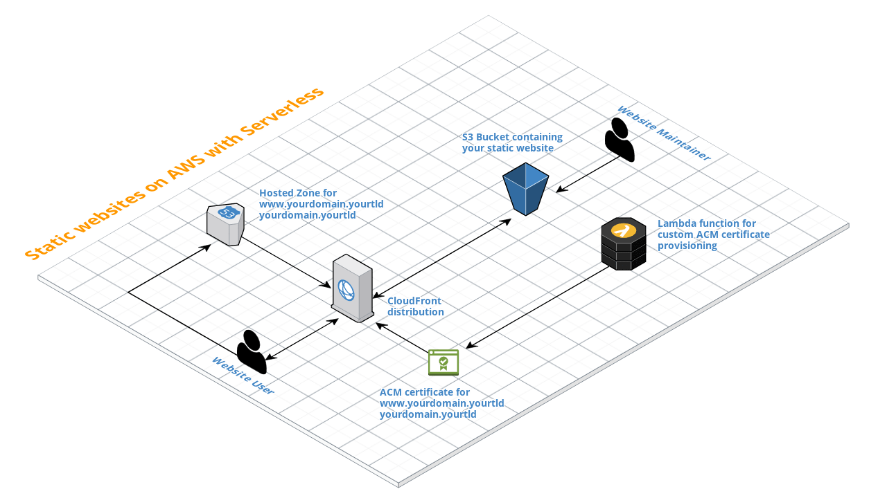

# Serverless URL Shortener

A lightweight URL shortener built with the Serverless Framework using AWS Lambda and S3. Each URL redirection is stored as an S3 object with the `Website-Redirect-Location` metadata key set to the forwarding web address. AWS Lambda is used to create an API to save these objects. The website is served from the same S3 bucket.

## Setup

### Install dependencies

Head on over to the [Serverless Framework docs](https://medium.com/r/?url=https%3A%2F%2Fserverless.com%2Fframework%2Fdocs%2Fproviders%2Faws%2Fguide%2Fquick-start%2F) and run through their quick-start guide. It’s mentioned in there as part of your setup, but be sure to install the AWS CLI and configure your AWS credentials. Then run `npm install` to get the NPM dependencies for the project.

### Add environment variables

Create a copy of _.env.example_ for each "stage" (e.g. _.env.staging_, _.env.production_) and then customise as appropriate for your setup.

| Name                 | Description                                                                                                                  | Required |
| -------------------- | ---------------------------------------------------------------------------------------------------------------------------- | -------- |
| AWS_PROFILE          | AWS profile setup in `~/.aws/credentials`                                                                                    | N        |
| BUCKET               | The S3 bucket name to use. This will form part of the URL shortener website address if you're not using a custom domain.     | Y        |
| REGION               | The [AWS region](http://docs.aws.amazon.com/AWSEC2/latest/UserGuide/using-regions-availability-zones.html) to deploy to.     | Y        |
| API_URL              | The URL of the endpoint that forms should be sent to. This is only known after the first deployment, so leave empty for now. | Y        |
| API_DOMAIN           | Custom API domain                                                                                                            | Y        |
| API_HOSTED_ZONE      | AWS Route53 hosted zone ID with the custom API domain                                                                        | Y        |
| API_CERTIFICATE_NAME | AWS Certificate Authority certificate name for API domain                                                                    | Y        |
| API_BASE_ENDPOINT    | API Gateway base path (e.g. prefix) for lambda function                                                                      | Y        |
| SHORT_URL            | The base URL of shortened links (without a trailing slash).                                                                  | Y        |
| SHORT_DOMAIN         | Custom short domain                                                                                                          | Y        |
| SHORT_HOSTED_ZONE    | AWS Route53 hosted zone ID with the custom short domain                                                                      | Y        |
| SHORT_DOMAIN_ACM_ARN | AWS Certificate Authority certificate name for short domain                                                                  | Y        |
| TITLE                | Customize the title of the website and form                                                                                  | N        |
| CREDIT               | Customize the credit name in the footer                                                                                      | N        |
| CREDIT_URL           | Customize the credit link in the footer                                                                                      | N        |

### Deploy API

Run `npm run deploy` to deploy the API and website to AWS. The resources defined in _serverless.yml_ will be automatically instantiated using CloudFormation.

Prefix the command with the stage you want to deploy (e.g. `STAGE=production npm run deploy`).

#### CloudFormation

All AWS resources are created automatically. Heavily borrowed from [serverless-aws-static-websites](https://github.com/tobilg/serverless-aws-static-websites).

### Build template

Run `npm run build` to set the form action on the website template to `API_URL` from _config.json_.

### Deploy website

Run `npm run deploy:client` to deploy the website using the AWS CLI.

_You can add a `?vanity=` query string parameter to the homepage to specify a vanity name instead of a randomly-generated one. If the name is taken, a random one will be used._

## Libraries used

- [Serverless Framework](https://serverless.com) for project structure and deployment.
- [PaperCSS Framework](https://github.com/papercss/papercss) for the frontend design.
- [jQuery](https://jquery.com) to simplify working with the DOM and making AJAX queries.
- [nanoid](https://github.com/ai/nanoid) to generate random paths with more randomness.
- [nanoid-good](https://github.com/y-gagar1n/nanoid-good) to help avoid generating any obscene words.
